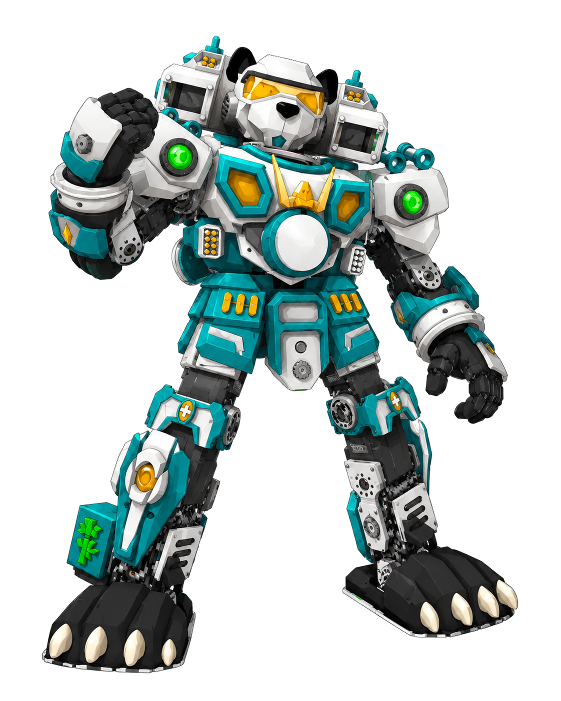
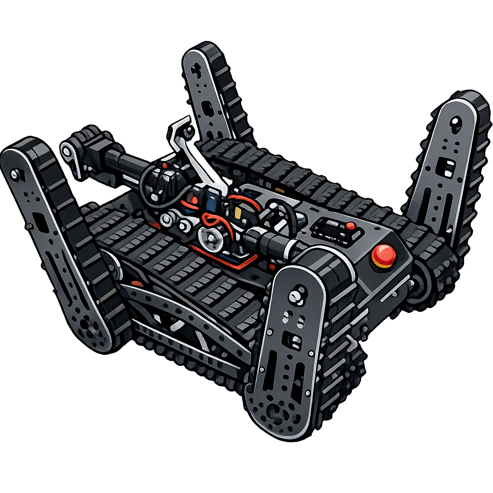
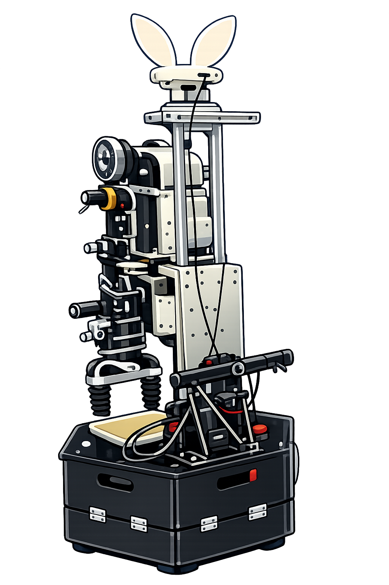
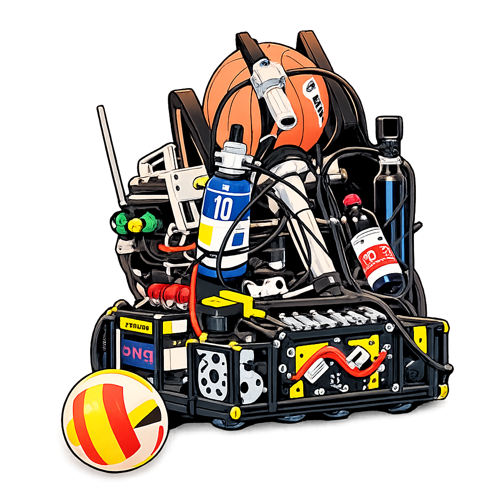

---
hide:
    - navigation
    - footer
title: 首页
---

<section class="site-hero" data-hero-image="page/比赛/assets/dance-02.png">
  

    
NORTHWESTERN POLYTECHNICAL UNIVERSITY · EST. 2003

    <h1>西北工业大学 舞蹈机器人创新实践基地</h1>
    
做真实的机器人，在完整工程实践中连接机械、电子与软件。

    

      <a class="md-button md-button--primary" href="page/比赛/">查看机器人档案</a>
      <a class="md-button" href="page/招新/">加入我们</a>
    

  

  

    ROBOTICS
    DESIGN · CONTROL · PERCEPTION
  

</section>

<section class="stats-grid reveal" aria-label="基地概况">
  

    <strong class="stat-value">2003</strong>
    基地成立
  

  

    <strong class="stat-value" data-counter-target="4" aria-hidden="true">4</strong>
    项目组
  

  

    <strong class="stat-value" data-counter-target="3" aria-hidden="true">3</strong>
    技术方向
  

</section>

## 从项目走进真实工程

基地围绕舞蹈、救援、家政与篮球机器人开展长期项目。同学们从任务需求出发，共同完成方案、结构、电子系统、程序与整机调试。

  <a class="robot-card reveal" href="page/比赛/舞蹈组/">
    
    <small>01 / DANCE</small><strong>舞蹈机器人</strong>结构、外观与动作控制协同，完成兼具工程实现与舞台表现的机器人作品。<b>进入档案 →</b>
  </a>
  <a class="robot-card reveal" href="page/比赛/救援组/">
    
    <small>02 / RESCUE</small><strong>救援机器人</strong>面向越障、搜救、自主建图与目标定位，探索复杂环境中的可靠行动。<b>进入档案 →</b>
  </a>
  <a class="robot-card reveal" href="page/比赛/家政组/">
    
    <small>03 / SERVICE</small><strong>家政机器人</strong>围绕物品传递、目标跟随等服务任务，实现机械、电子与软件系统协同。<b>进入档案 →</b>
  </a>
  <a class="robot-card reveal" href="page/比赛/篮球组/">
    
    <small>04 / BASKETBALL</small><strong>篮球机器人</strong>完成球类识别、抓取、运动与投篮控制，在实物和仿真环境中协同对抗。<b>进入档案 →</b>
  </a>

## 三条技术路径，一台完整机器人

  <a class="tech-card reveal" href="page/方向/机械/"><small>MECHANICAL</small><strong>机械方向</strong>结构设计、三维建模、工程图、加工交付、装配与维护。<b>查看方向 →</b></a>
  <a class="tech-card reveal" href="page/方向/电子/"><small>ELECTRONICS</small><strong>电子方向</strong>单片机、PCB、电机控制、传感器接入与硬件调试。<b>查看方向 →</b></a>
  <a class="tech-card reveal" href="page/方向/软件/"><small>SOFTWARE</small><strong>软件方向</strong>感知、ROS 通信、控制程序，以及相关前后端软件开发。<b>查看方向 →</b></a>

<section class="engineering-band reveal">
  

    <small>OPEN ENGINEERING</small>
    <h2>从代码仓库到比赛现场</h2>
    
基地持续积累真实机器人项目，让知识、设计和调试经验能够被下一代成员继续使用。

  

  

    <a href="https://github.com/NPU-Home">家政组项目</a>
    <a href="https://github.com/xm-project">晓萌历史代码</a>
    <a href="https://github.com/team-explorer-rescue-robot">救援组项目</a>
  

</section>

<section class="recruit-cta reveal">
  <small>2026 RECRUITMENT</small>
  <h2>把兴趣落到实物，把知识变成作品</h2>
  
无论你现在掌握多少工具，只要愿意持续学习、认真动手并与团队协作，就能从一个清晰的小任务开始。

  <a class="md-button md-button--primary" href="page/招新/">查看 2026 招新信息</a>
</section>
