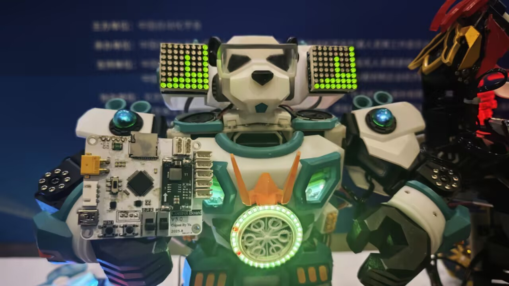
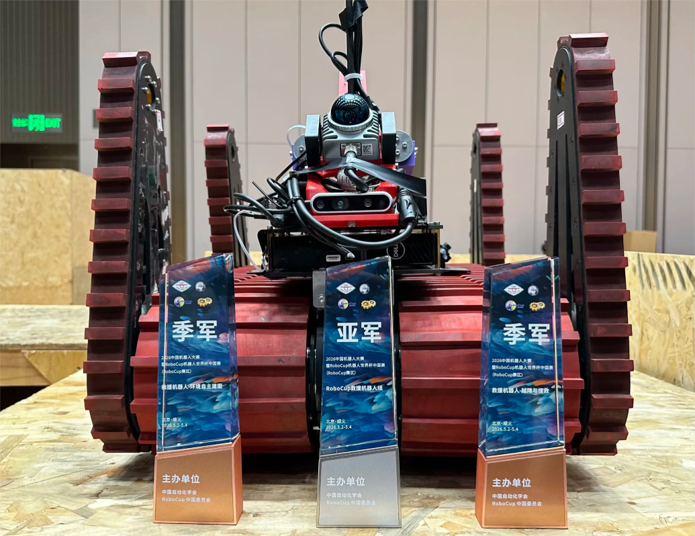
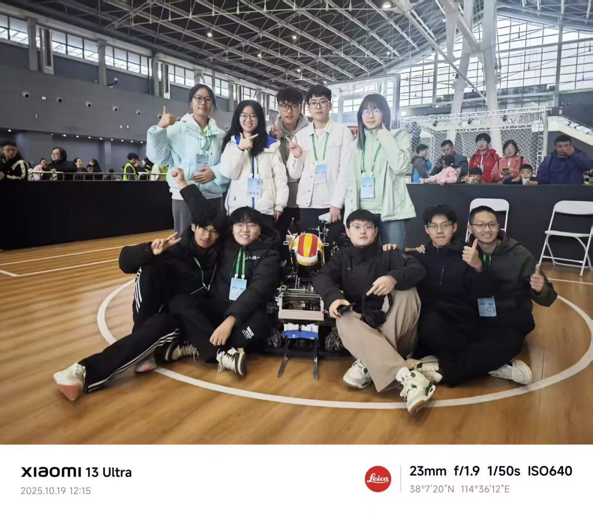

---
hide:
    - navigation
    - footer
title: 首页
---

<section class="site-hero" data-hero-image="page/比赛/assets/dance-02.png">
  

    
NORTHWESTERN POLYTECHNICAL UNIVERSITY / EST. 2003

    <h1>西北工业大学 舞蹈机器人创新实践基地</h1>
    
以真实机器人项目连接机械、电子与软件，在持续设计、制造与调试中建立完整工程能力。

    

      <a class="md-button md-button--primary" href="page/比赛/">查看机器人档案</a>
      <a class="md-button" href="page/招新/">加入我们</a>
    

  

  

    PROJECT BASE / 2003—2026
    DESIGN · BUILD · TEST
  

</section>

<section class="overview-intro reveal">
  

    <small>ABOUT THE BASE</small>
    <h2>在真实项目中理解完整工程</h2>
  

  
基地面向本科生开展长期机器人项目实践。成员围绕明确任务协同完成结构设计、电子开发、程序编写、整机装配与系统调试，让课堂知识在一台能够运行的机器人上彼此连接。

</section>

<section class="stats-grid reveal" aria-label="基地概况">
  

    <strong class="stat-value">2003</strong>
    基地成立
  

  

    <strong class="stat-value" data-counter-target="4" aria-hidden="true">4</strong>
    项目组
  

  

    <strong class="stat-value" data-counter-target="3" aria-hidden="true">3</strong>
    技术方向
  

</section>

## 从项目走进真实工程

基地围绕舞蹈、救援、家政与篮球机器人开展长期项目。同学们从任务需求出发，共同完成方案、结构、电子系统、程序与整机调试。

  <a class="robot-card reveal" href="page/比赛/舞蹈组/">
    
    <small>01 / DANCE</small><strong>舞蹈机器人</strong>结构、外观与动作控制协同，完成兼具工程实现与舞台表现的机器人作品。<b>进入档案 →</b>
  </a>
  <a class="robot-card reveal" href="page/比赛/救援组/">
    
    <small>02 / RESCUE</small><strong>救援机器人</strong>面向越障、搜救、自主建图与目标定位，探索复杂环境中的可靠行动。<b>进入档案 →</b>
  </a>
  <a class="robot-card reveal" href="page/比赛/家政组/">
    
    <small>03 / SERVICE</small><strong>家政机器人</strong>围绕物品传递、目标跟随等服务任务，实现机械、电子与软件系统协同。<b>进入档案 →</b>
  </a>
  <a class="robot-card reveal" href="page/比赛/篮球组/">
    
    <small>04 / BASKETBALL</small><strong>篮球机器人</strong>完成球类识别、抓取、运动与投篮控制，在实物和仿真环境中协同对抗。<b>进入档案 →</b>
  </a>

## 三条技术路径，一台完整机器人

  <a class="tech-card reveal" href="page/方向/软件/"><small>SOFTWARE</small><strong>软件方向</strong>感知、ROS 通信、控制程序，以及相关前后端软件开发。<b>查看方向 →</b></a>
  <a class="tech-card reveal" href="page/方向/电子/"><small>ELECTRONICS</small><strong>电子方向</strong>单片机、PCB、电机控制、传感器接入与硬件调试。<b>查看方向 →</b></a>
  <a class="tech-card reveal" href="page/方向/机械/"><small>MECHANICAL</small><strong>机械方向</strong>结构设计、三维建模、工程图、加工交付、装配与维护。<b>查看方向 →</b></a>

## 一台机器人如何走向现场

从需求判断到现场测试，每一步都有清晰的工程对象，也需要不同方向的成员共同完成。

<section class="practice-flow reveal" aria-label="机器人项目工程流程">
  
<small>01</small><strong>任务定义</strong>理解场景、规则与约束

  
<small>02</small><strong>方案设计</strong>拆分系统与技术接口

  
<small>03</small><strong>结构制造</strong>建模、加工与装配

  
<small>04</small><strong>软硬件开发</strong>控制、感知与通信

  
<small>05</small><strong>系统联调</strong>定位并解决协同问题

  
<small>06</small><strong>现场迭代</strong>测试、记录与持续改进

</section>

<section class="engineering-band reveal">
  

    <small>PROJECT RECORDS</small>
    <h2>让工程经验可以继续使用</h2>
    
基地持续整理项目记录、技术资料与调试经验，帮助后续成员在已有工作上继续推进。

  

  

    <a href="https://github.com/NPU-Home">家政组项目</a>
    <a href="https://github.com/xm-project">晓萌历史代码</a>
    <a href="https://github.com/team-explorer-rescue-robot">救援组项目</a>
  

</section>

<section class="recruit-cta reveal">
  <small>2026 RECRUITMENT</small>
  <h2>从一个清晰的工程任务开始</h2>
  
基地欢迎愿意持续学习、认真动手并与团队协作的同学。新成员将从基础训练和具体模块开始，逐步参与完整项目。

  <a class="md-button md-button--primary" href="page/招新/">查看 2026 招新信息</a>
</section>
