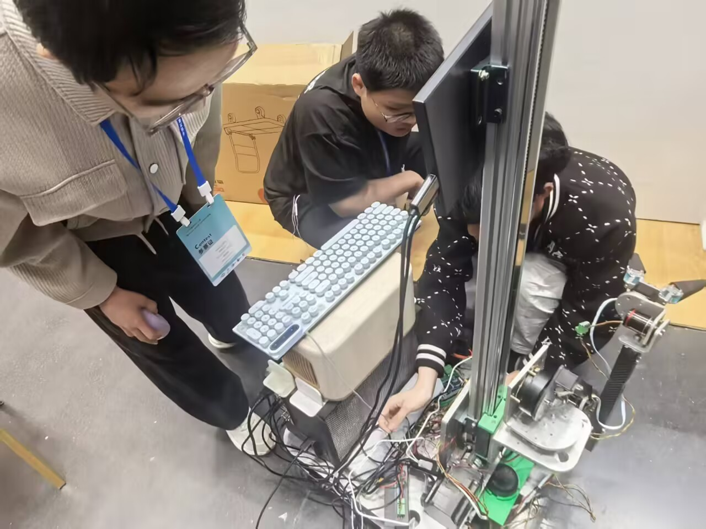
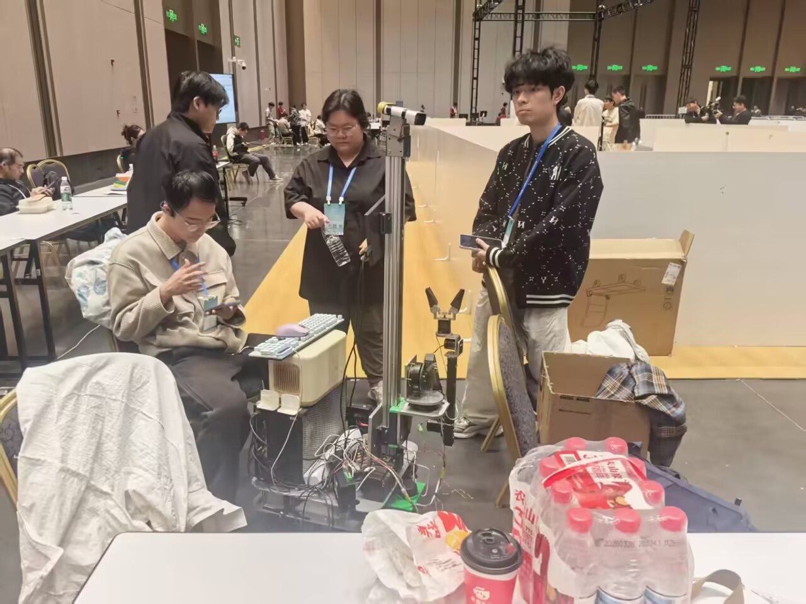
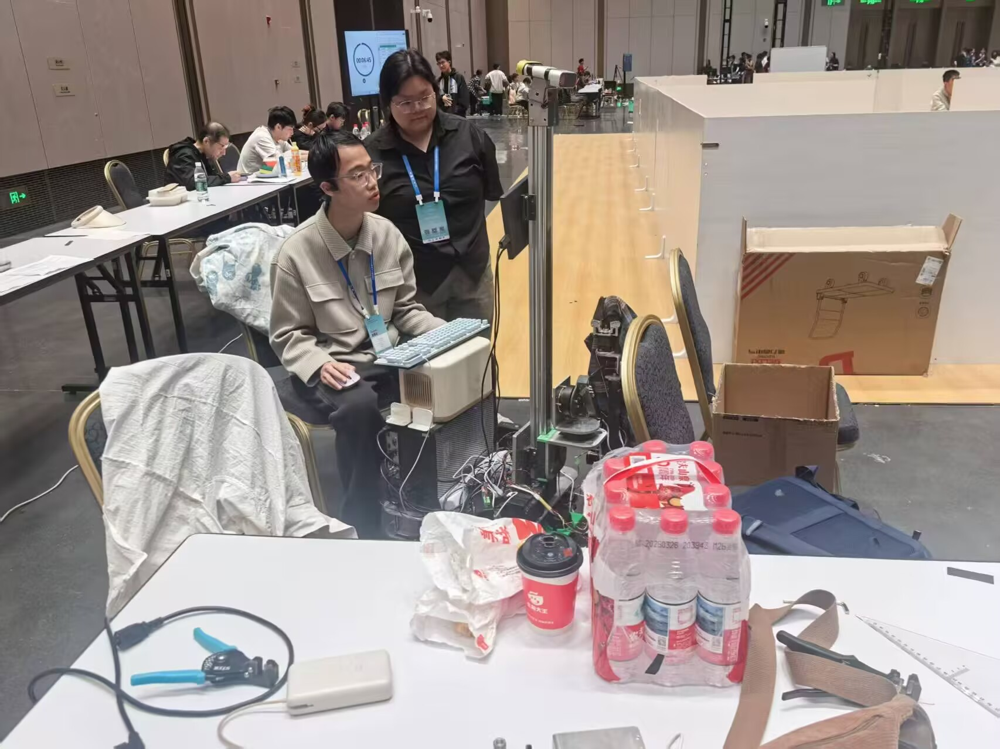
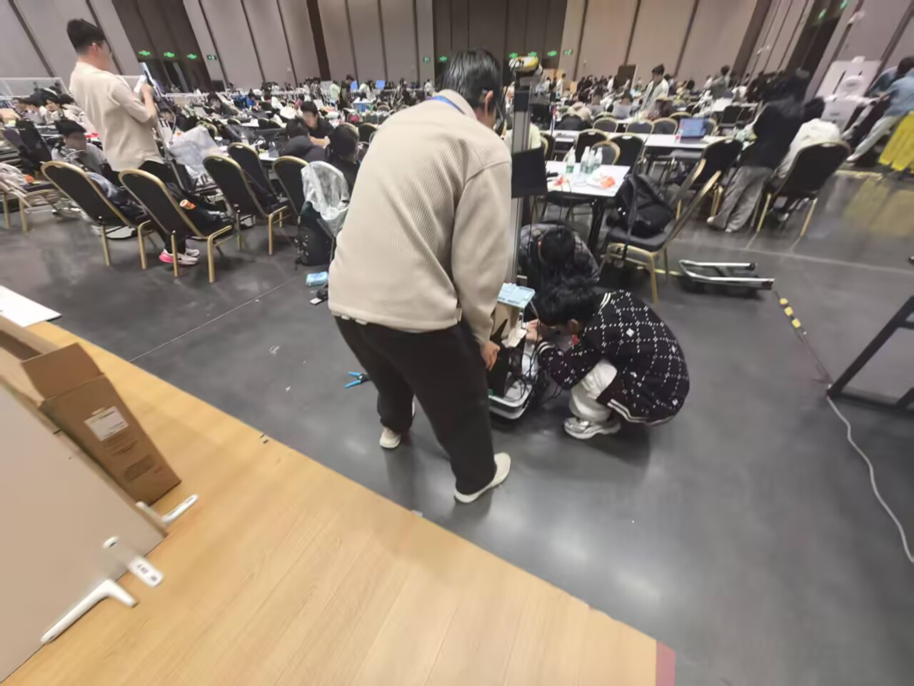
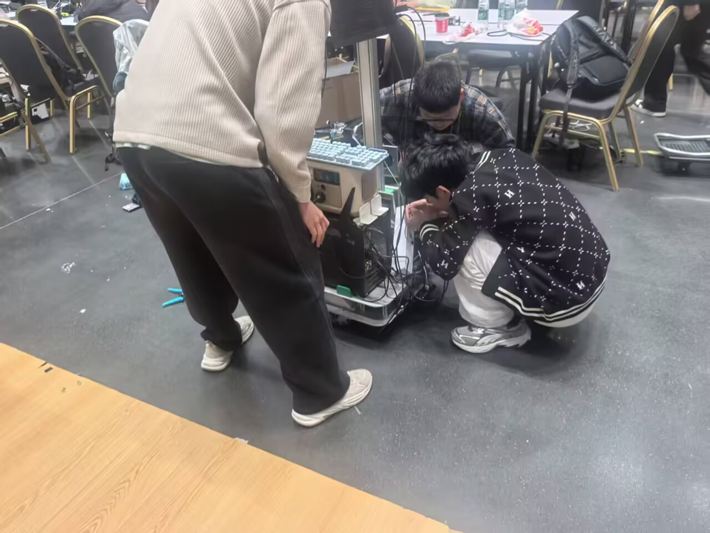

# 家政机器人

家政组围绕物品传递、目标跟随等服务任务，自主完成机械结构、电子系统、感知程序与整机控制，在比赛现场进行完整系统验证。

<figure markdown>

<figcaption>成员检查家政机器人的线缆、执行机构与上位机连接。</figcaption>
</figure>

<figure markdown>

<figcaption>比赛任务开始前的系统状态确认。</figcaption>
</figure>

<figure markdown>

<figcaption>成员通过上位机完成机器人任务调试。</figcaption>
</figure>

<figure markdown>

<figcaption>比赛间隙进行快速故障定位与恢复。</figcaption>
</figure>

<figure markdown>

<figcaption>围绕机械、电子和软件接口开展现场协同维护。</figcaption>
</figure>

