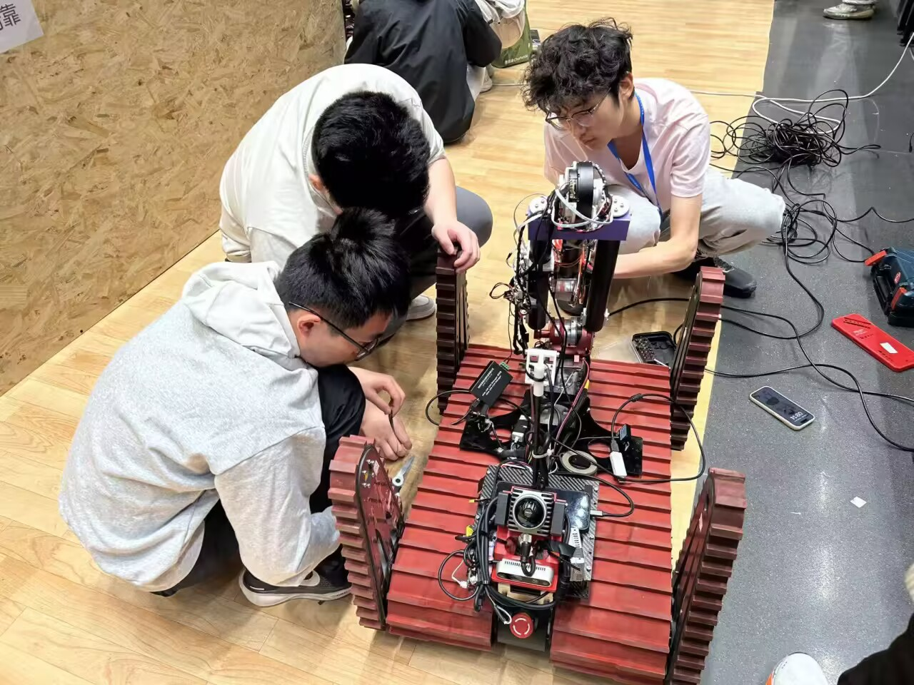
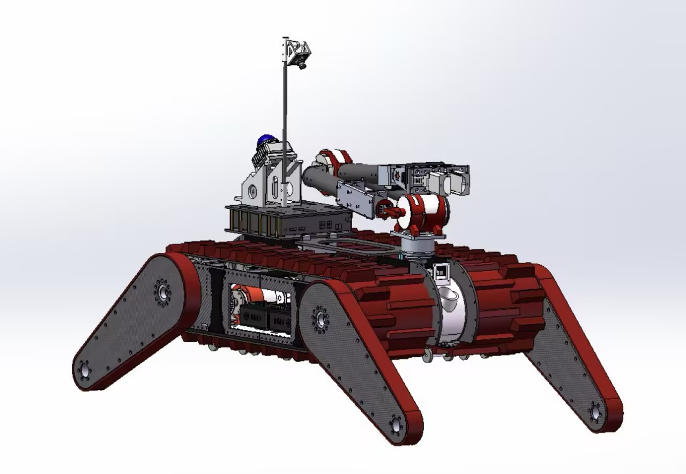
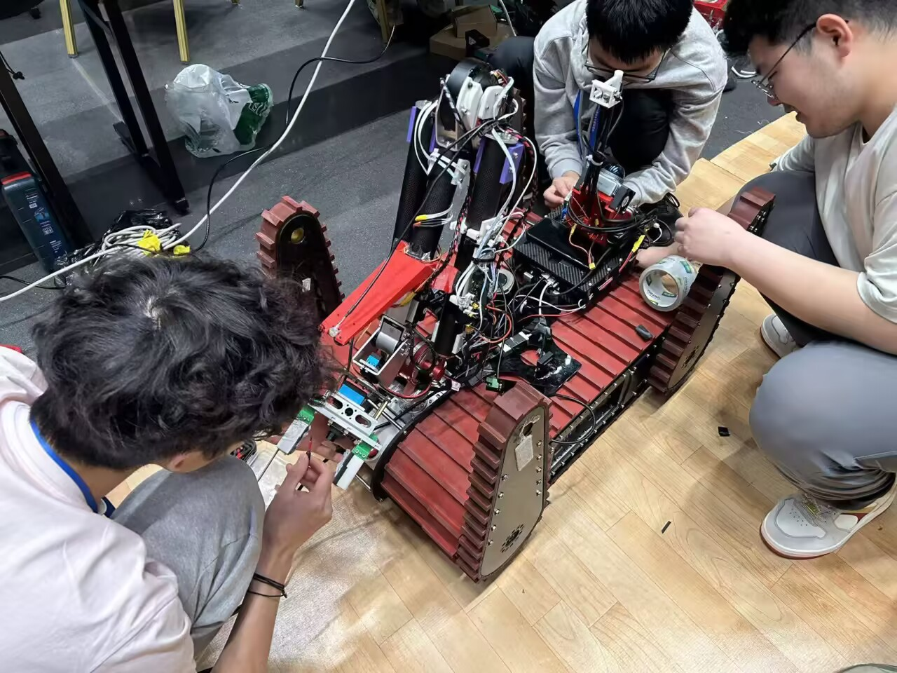

# 救援机器人

救援组面向复杂环境中的越障、搜救、自主建图和目标定位，持续研究履带结构、导航控制与多传感器信息融合。

<figure markdown>

<figcaption>比赛现场的机械检查与履带机构调试。</figcaption>
</figure>

<figure markdown>

<figcaption>救援机器人结构设计模型，包含履带底盘、机械臂与感知设备安装位。</figcaption>
</figure>

<figure markdown>

<figcaption>救援机器人及项目竞赛成果展示。</figcaption>
</figure>

<figure markdown>

<figcaption>成员协同检查线路、传感器与执行机构。</figcaption>
</figure>

