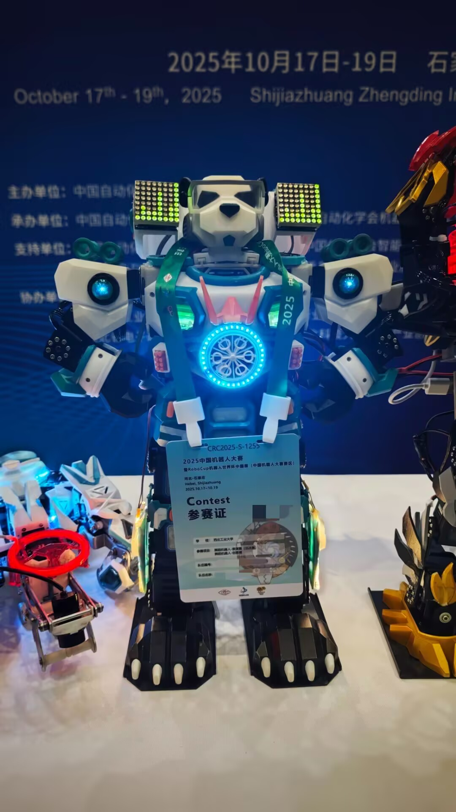

# 舞蹈机器人

舞蹈组围绕小型机器人的结构设计、外观呈现、语音与图像感知、动作控制开展实践，让机械结构、电子系统与表演编排形成完整作品。

<figure markdown>

<figcaption>舞蹈机器人在比赛展台展示，机身集成灯光、控制与执行机构。</figcaption>
</figure>

<figure markdown>

<figcaption>机器人与自主设计控制板，体现机械、电子与软件的协同实现。</figcaption>
</figure>

